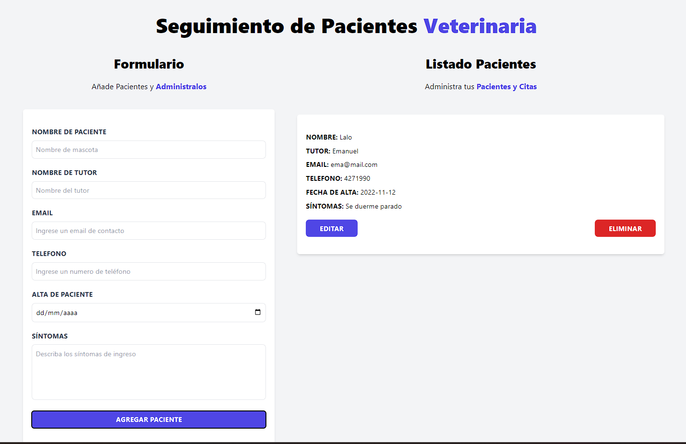

# CRUD - Citas para pacientes de Veterinaria

Esta es una app de tipo CRUD que maneja la creacion y modificacion de citas a travez de un formulario para la carga de datos y un listado de citas agregadas.
Tiene la posibilidad de editar y eliminar cada cita y que estas queden guardadas en LocalStorage.

### Herramientas

Javascript - ReactJS - Vite

Deploy: https://react-vet-patients.netlify.app/

